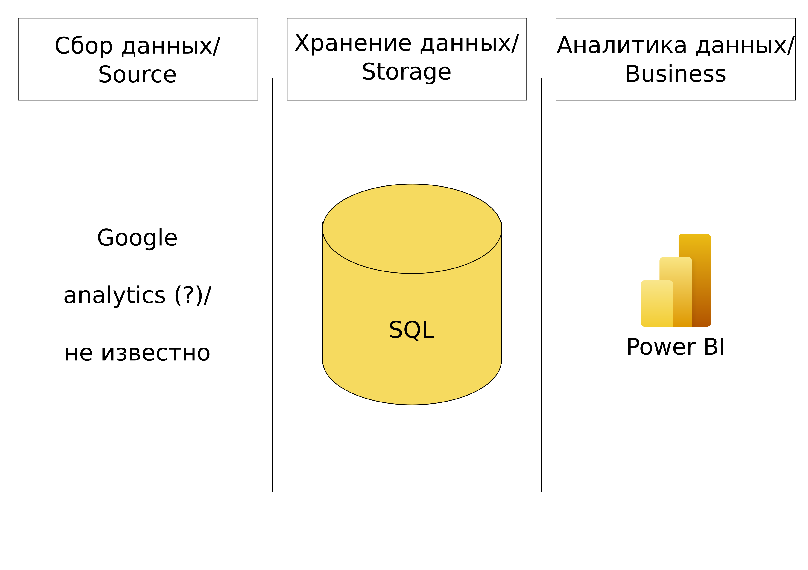
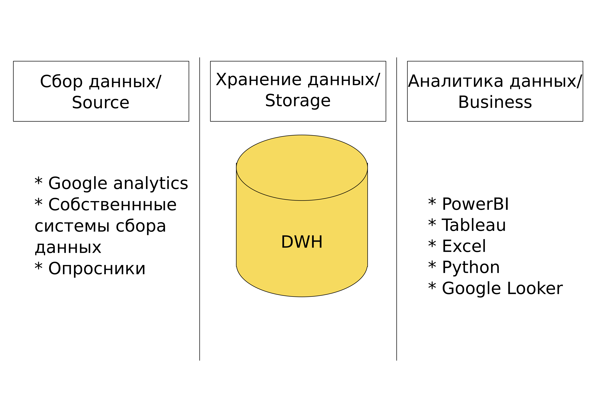

# DE-101-Modules-Module01-DE---101-Lab-1.1
## Data Learn practicum Data engeneering

Структуру пробовала бэк-инжинирить вот [из этой вакансии](https://www.startupjobs.cz/nabidka/71695/power-bi-data-analyst-prace-na-atraktivnim-projektu)

Общая структура бизнес-аналитических решений из лекции:

